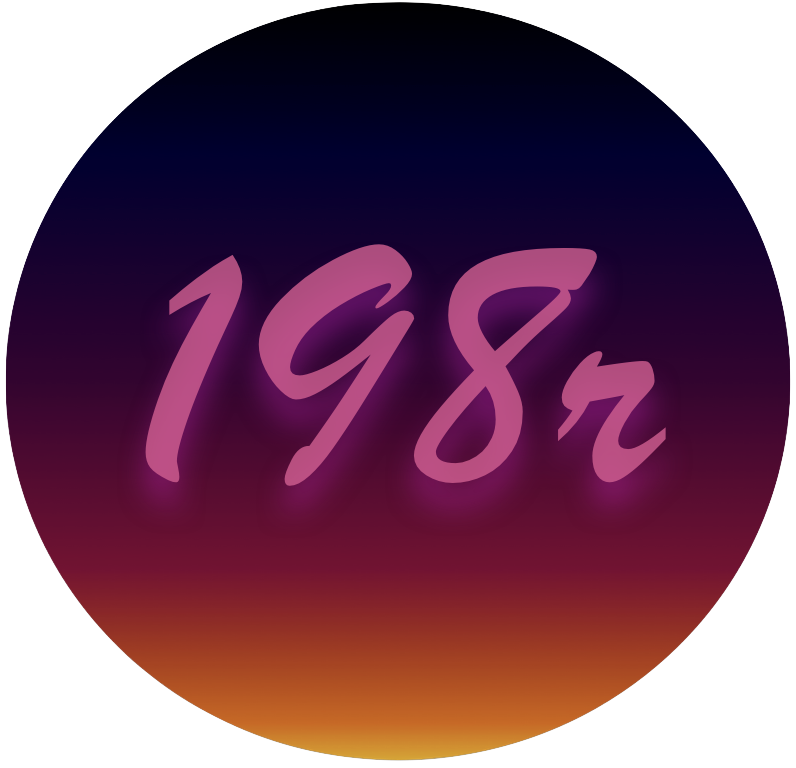
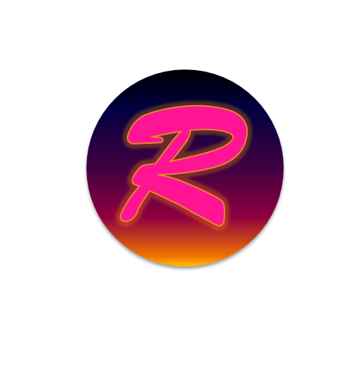
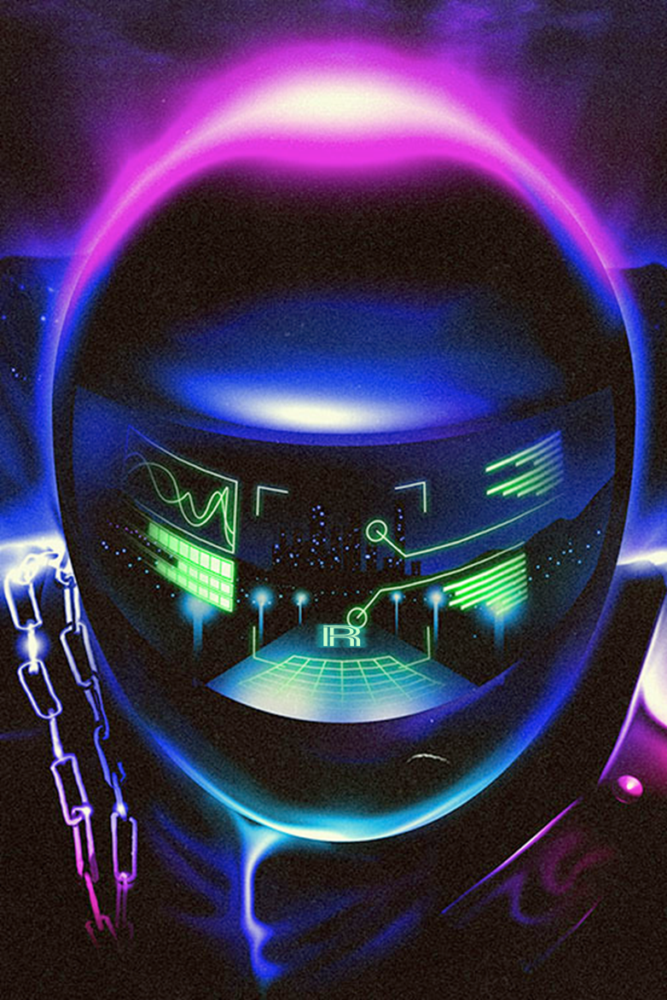
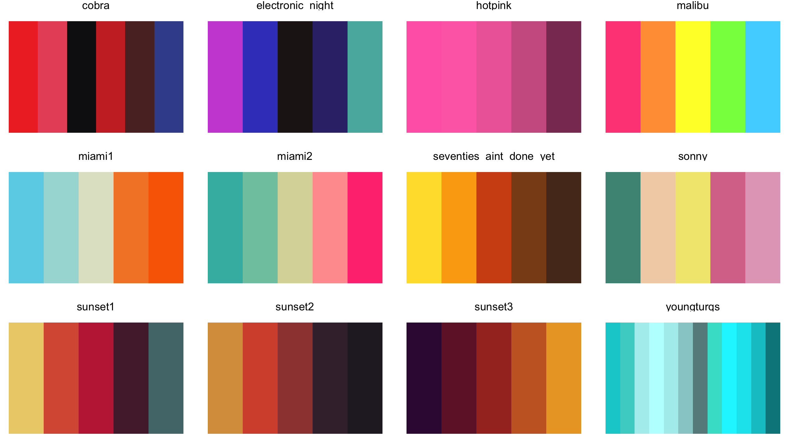

<!-- # <span style="color:#FF6EB4; font-family: 'Brush Script MT'">198R</span>  -->



<br>

R with its collar flipped, or the movie Drive if it was all about R
programming, writing R code on a beach in Miami as the sun sets, R
wearing sunglasses at night, R asking you to take it home tonight
because it doesn’t want to let you go until you see the light, Countach
&gt; Testarrosa, but Delorean &gt; all except R, R if Automan had lasted
longer than 1 season, driving down Mulholland Dr. at night thinking
about R code, R playing a cello at the end of a dock on a lake before
taking a ride in a badass helicopter, R with its hair all done up with
Aquanet…




## Installation

For the development version, install directly from GitHub:

``` r
# install.packages("remotes") 
remotes::install_github("m-clark/NineteenEightyR") 
```

## Palettes


